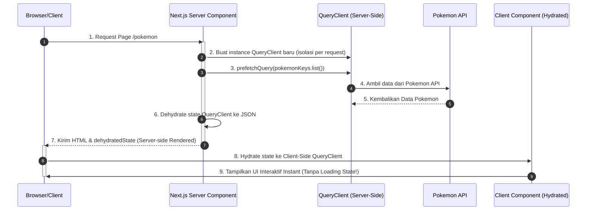

# Setup TanStack Query Terbaik & Scalable di Next.js App Router (React 19)

Panduan ini menjelaskan arsitektur, struktur folder, dan best practices untuk menyiapkan **TanStack Query (React Query) v5** secara scalable dan aman (SSR-safe) pada aplikasi Next.js Anda.

---

## 🏗️ Alur SSR Hydration dengan TanStack Query

Ketika menggunakan Next.js App Router, alur pengisian data (hydration) dari server ke client terjadi sebagai berikut:



---

## 🛠️ Langkah 1: Instalasi Dependensi

Pertama, instal paket TanStack Query dan devtools pendukungnya:

```bash
npm install @tanstack/react-query
npm install --save-dev @tanstack/react-query-devtools
```

---

## 📂 Langkah 2: Struktur Folder Scalable

Struktur folder yang rapi sangat penting untuk menjaga codebase tetap clean seiring berkembangnya aplikasi. Berikut adalah rekomendasi struktur folder untuk modul Pokémon:

```text
src/
├── app/
│   ├── layout.tsx
│   ├── page.tsx
│   └── providers.tsx           # Wrapper untuk QueryClientProvider
├── components/                 # Reusable UI components
├── core/                       # Pengaturan sistem inti
│   └── api/
│       └── client.ts           # Axios / Fetch client configuration
├── hooks/                      # Custom hooks global
└── features/                   # Fitur tersegregasi (Domain-Driven)
    └── pokemon/
        ├── api/                # Endpoint penarikan data
        │   └── pokemon.api.ts
        ├── hooks/              # Query & Mutation hooks khusus Pokémon
        │   ├── useGetPokemonList.ts
        │   └── useGetPokemonDetail.ts
        ├── keys/               # Query Key Factory untuk Pokémon
        │   └── pokemon.keys.ts
        ├── types/              # Type definitions untuk domain ini
        │   └── pokemon.types.ts
        └── components/         # Komponen khusus fitur Pokémon
```

---

## ⚙️ Langkah 3: Konfigurasi QueryClient & Provider (SSR-Safe)

Pada Next.js, sangat krusial untuk **tidak membuat QueryClient di lingkup global file** karena instance tersebut akan dibagikan ke semua request pengguna (menyebabkan kebocoran data antar user).

### 1. Membuat Wrapper Provider (`src/app/providers.tsx`)

Kami mendefinisikan QueryClient menggunakan `useState` atau fungsi helper agar instance diisolasi per session/request di sisi client, dan dibuat segar di server untuk setiap request.

```tsx
"use client";

import { isServer, QueryClient, QueryClientProvider } from "@tanstack/react-query";
import { ReactQueryDevtools } from "@tanstack/react-query-devtools";
import * as React from "react";

function makeQueryClient() {
  return new QueryClient({
    defaultOptions: {
      queries: {
        // Dengan SSR, biasanya kita ingin menyetel staleTime di atas 0
        // untuk menghindari refetching instan di sisi client setelah hydration.
        staleTime: 60 * 1000, // 1 menit
        gcTime: 5 * 60 * 1000, // 5 menit
        refetchOnWindowFocus: false, // Kurangi request berlebih saat berpindah tab
        retry: 1, // Batasi percobaan ulang jika terjadi kegagalan
      },
    },
  });
}

let browserQueryClient: QueryClient | undefined = undefined;

export function getQueryClient() {
  if (isServer) {
    // Sisi Server: Selalu buat client baru
    return makeQueryClient();
  } else {
    // Sisi Browser: Buat client baru jika belum ada
    if (!browserQueryClient) browserQueryClient = makeQueryClient();
    return browserQueryClient;
  }
}

export default function Providers({ children }: { children: React.ReactNode }) {
  const queryClient = getQueryClient();

  return (
    <QueryClientProvider client={queryClient}>
      {children}
      {/* Devtools akan otomatis hilang pada mode Production */}
      <ReactQueryDevtools initialIsOpen={false} />
    </QueryClientProvider>
  );
}
```

### 2. Hubungkan ke Root Layout (`src/app/layout.tsx`)

Bungkus aplikasi Anda dengan `Providers` yang baru saja dibuat.

```tsx
import type { Metadata } from "next";
import { Geist, Geist_Mono } from "next/font/google";
import Providers from "./providers";
import "./globals.css";

const geistSans = Geist({
  variable: "--font-geist-sans",
  subsets: ["latin"],
});

const geistMono = Geist_Mono({
  variable: "--font-geist-mono",
  subsets: ["latin"],
});

export const metadata: Metadata = {
  title: "Pokemon App - TanStack Query Edition",
  description: "Scalable Pokédex built with Next.js and TanStack Query",
};

export default function RootLayout({
  children,
}: Readonly<{
  children: React.ReactNode;
}>) {
  return (
    <html
      lang="en"
      className={`${geistSans.variable} ${geistMono.variable} h-full antialiased`}
    >
      <body className="min-h-full flex flex-col bg-zinc-50 dark:bg-zinc-950 text-zinc-900 dark:text-zinc-50">
        <Providers>{children}</Providers>
      </body>
    </html>
  );
}
```

---

## 🔑 Langkah 4: Scalability Patterns (Pola Skalabilitas)

### A. Query Key Factory (`src/features/pokemon/keys/pokemon.keys.ts`)

Menulis query key secara manual berupa array string (seperti `['pokemon', id]`) rentan terhadap kesalahan ketik (typo) yang membuat invalidasi cache gagal bekerja. Gunakan pola objek terpusat ini:

```typescript
export const pokemonKeys = {
  all: ["pokemon"] as const,
  lists: () => [...pokemonKeys.all, "list"] as const,
  list: (filters: Record<string, any>) => [...pokemonKeys.lists(), filters] as const,
  details: () => [...pokemonKeys.all, "detail"] as const,
  detail: (nameOrId: string | number) => [...pokemonKeys.details(), nameOrId] as const,
};
```

### B. API Fetcher terpisah (`src/features/pokemon/api/pokemon.api.ts`)

Pisahkan logika pemanggilan HTTP dari hook TanStack Query agar dapat digunakan kembali di Server Components (tanpa React Hooks).

```typescript
import { PokemonListResponse, PokemonDetail } from "../types/pokemon.types";

const BASE_URL = "https://pokeapi.co/api/v2";

export async function fetchPokemonList(limit = 20, offset = 0): Promise<PokemonListResponse> {
  const res = await fetch(`${BASE_URL}/pokemon?limit=${limit}&offset=${offset}`);
  if (!res.ok) throw new Error("Gagal mengambil daftar Pokémon");
  return res.json();
}

export async function fetchPokemonDetail(nameOrId: string | number): Promise<PokemonDetail> {
  const res = await fetch(`${BASE_URL}/pokemon/${nameOrId}`);
  if (!res.ok) throw new Error(`Gagal mengambil detail Pokémon: ${nameOrId}`);
  return res.json();
}
```

### C. Custom Hooks terbungkus (`src/features/pokemon/hooks/useGetPokemonList.ts`)

UI Component tidak boleh memanggil `useQuery` secara langsung dengan URL fetcher-nya. Gunakan custom hook pembungkus:

```typescript
import { useQuery } from "@tanstack/react-query";
import { fetchPokemonList } from "../api/pokemon.api";
import { pokemonKeys } from "../keys/pokemon.keys";

export function useGetPokemonList(limit = 20, offset = 0) {
  return useQuery({
    queryKey: pokemonKeys.list({ limit, offset }),
    queryFn: () => fetchPokemonList(limit, offset),
    // Sangat berguna untuk pagination: pertahankan data lama saat memuat data baru
    placeholderData: (previousData) => previousData,
  });
}
```

---

## ⚡ Langkah 5: Pola Fetching Data (SSR Hydration)

Untuk performa SEO yang optimal dan Load Time yang sangat cepat, lakukan prefetch data di **Next.js Server Component**, kemudian alirkan ke client menggunakan `<HydrationBoundary>`.

### Contoh Implementasi di Page (`src/app/page.tsx`)

```tsx
import { dehydrate, HydrationBoundary } from "@tanstack/react-query";
import { getQueryClient } from "./providers";
import { fetchPokemonList } from "@/features/pokemon/api/pokemon.api";
import { pokemonKeys } from "@/features/pokemon/keys/pokemon.keys";
import PokemonListClient from "@/features/pokemon/components/PokemonListClient";

export default async function HomePage() {
  const queryClient = getQueryClient();

  // Prefetch data langsung dari server saat page dimuat pertama kali
  await queryClient.prefetchQuery({
    queryKey: pokemonKeys.list({ limit: 20, offset: 0 }),
    queryFn: () => fetchPokemonList(20, 0),
  });

  return (
    // Lewatkan dehydrated state ke client
    <HydrationBoundary state={dehydrate(queryClient)}>
      <main className="container mx-auto py-8 px-4">
        <h1 className="text-3xl font-extrabold mb-6 tracking-tight">Pokédex</h1>
        {/* Komponen Client ini akan langsung terisi data secara instan */}
        <PokemonListClient />
      </main>
    </HydrationBoundary>
  );
}
```

---

## 💡 Best Practices Tambahan untuk Skala Besar

1. **Gunakan Optimistic Updates untuk Mutation**: Saat melakukan aksi *like*, *favorite*, atau mutasi data lainnya, update cache lokal terlebih dahulu sebelum respons server kembali agar UI terasa instan (Zero Latency).
2. **Invalidasi Cache secara Tepat**: Saat mutasi berhasil, gunakan `queryClient.invalidateQueries({ queryKey: pokemonKeys.lists() })` untuk memperbarui semua daftar Pokémon sekaligus secara otomatis.
3. **Penyimpanan Cache Statis**: Manfaatkan `staleTime` yang bijak. Data Pokémon adalah data statis yang jarang berubah; setel `staleTime` yang cukup tinggi (misal 5-10 menit) untuk mengurangi beban API server Anda secara signifikan.
4. **Infinite Scroll dengan `useInfiniteQuery`**: Jika membutuhkan list yang terus bertambah (lazy load), gunakan `useInfiniteQuery` yang terintegrasi sangat baik dengan Intersection Observer API.
